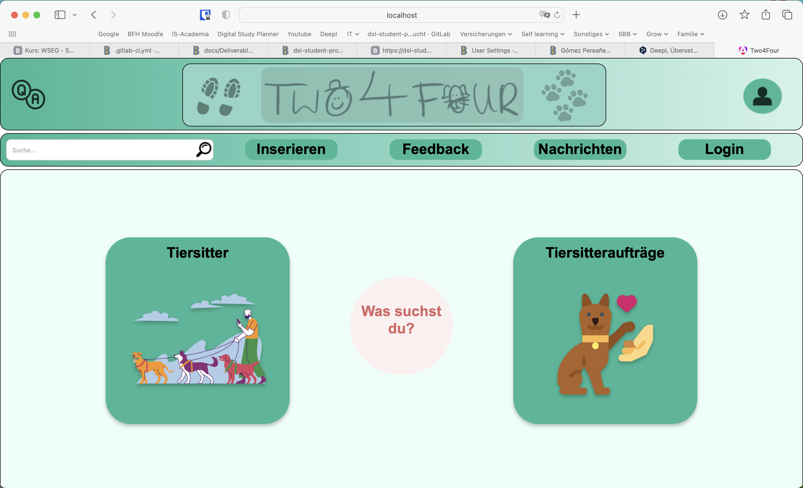
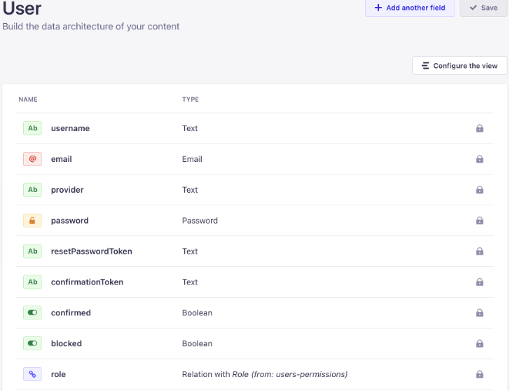

# Blogbeitrag 2

## Reflektion

### Wie zufriedenstellend haben wir bis jetzt unsere Ziele erreicht?

Wir sind insgesamt mit unserem bisherigen Fortschritt zufrieden. Einige der geplanten Funktionen, wie die Registration und Login Funktion, sind bereits implementiert und funktionieren bereits. Durch unsere Arbeit an diesem Projekt konnten wir unseren Wissensstand erheblich erweitern und neue Fähigkeiten erlernen, die wir erfolgreich angewendet haben. Das Design unserer Webseite entspricht genau unseren Vorstellungen. Das User Interface ist sehr einfach und benutzerfreundlich gestaltet, was uns besonders wichtig war.

Bei den Funktionen mussten wir jedoch einige Elemente streichen (genauer im nächsten Abschnitt), da sich diese als zu aufwendig herausstellten und wir unsere Kapazitäten überschätzt hatten. Wir werden diese Funktionen nur dann ergänzen, wenn vor der Abgabe noch genügend Zeit und Ressourcen zur Verfügung stehen.

### Wo mussten wir während der Entwicklung grössere Anpassungen machen?

Bei der Entwicklung hatten wir vor allem im Backend einige Schwierigkeiten und mussten dort viel Zeit investieren. Zunächst haben wir versucht, eigene Collection Types in Strapi zu erstellen. Später haben wir jedoch den voreingestellten Typ "User" verwendet, da dort bereits Voreinstellungen wie Passwort-Zurücksetzung integriert waren. Dies erforderte jedoch danach umfangreiche Anpassungen im gesamten Code, weil wir natürlich bereits mit dem alten Typ begonnen hatten zu coden.

Auch beim Pushen und Pullen sind teilweise Probleme aufgetreten, die mühsam zu beheben waren. Dadurch war der Fortschritt nicht bei allen Geräten auf dem aktuellen Stand. Die Lösung für dieses Problem lag darin, mehr Informationen über Branches zu sammeln und uns mit unsichtbaren Dateien wie ".DS_Store" vertraut zu machen, die Probleme verursachten. Die ".DS_Store"-Dateien wurden von Git als Änderungen erkannt, die gepusht oder gepullt werden sollten, was zu Konflikten führte. Wir haben gelernt, diese Dateien in die ".gitignore" aufzunehmen, um zukünftige Probleme zu vermeiden. Durch die Recherche und das Sammeln von Informationen, unter anderem durch Videos, konnten wir diese Herausforderung erfolgreich bewältigen.

Wie bei der Zwischenpräsentation erwähnt, mussten wir auch bei unseren Zielen Abstriche machen. Konkret haben wir die Messenger-Funktion und die Feedback-Funktion aus unseren Zielen gestrichen. Dies war notwendig, um uns auf die wichtigsten Aspekte des Projekts zu konzentrieren und sicherzustellen, dass wir eine stabile und funktionale Basis schaffen konnten.

### Warum mussten wir diese Anpassungen machen?

Wir mussten diese Anpassungen vornehmen, weil der Zeitaufwand insgesamt geringer war, als wenn wir versucht hätten, das notwendige Wissen zur Erstellung des User Collection Types von Grund auf zu erwerben. Durch die Nutzung des voreingestellten Typs "User" konnten wir auf bereits vorhandene Voreinstellungen zurückgreifen, was uns letztlich Zeit sparte. Die Anpassung des Codes bzw. die Integration der neuen APIs kostete uns natürlich auch noch Zeit.

### Wie haben wir unser Team aufgeteilt und wie hat sich die Teamzusammenstellung bewährt?

Unsere Aufgabenaufteilung besteht hauptsächlich in Frontend und Backend. Bei der Frontend-Entwicklung sind Carlos und Silvan eingeteilt, sprich bei der Backend-Entwicklung sind somit Daniel und Nelson vertreten.
Die Aufteilung funktionierte nicht schlecht, jedoch mussten wir untereinander teilweise aushelfen, da wir den Aufwand in gewissen Bereich leicht unterschätzt haben. Somit haben wir uns gegenseitig in den beiden Bereichen (Frontend und Backend) unterstützt.

### Gab es Zeiten wo ein Mitglied auf das Resultat eines anderen Mitglieds warten mussten?

Wie bereits erwähnt bei dem Pushen und Pullen hatten wir teilweise Probleme. Einen Zusammenhang hatte unser Datenmodell mit dem Backend in Strapi. Wir mussten als Team sicher gehen, dass unsere Entwicklungsbasis in Strapi wirklich mit dem angegebenen auf dem Datenmodell übereinstimmt.

### Was würdet ihr im nächsten Mal anders machen und warum?

Beim nächsten Mal würden wir von Beginn an mehr Zeit einplanen, sei es für eine detailliertere Planung und Definition der Anforderungen oder bei der Entwicklung. Dies würde uns helfen, den Zeitdruck und mögliche Missverständnisse zu vermeiden. Die Aufteilung der Arbeit innerhalb des Teams würden wir das nächste Mal wohl auch klarer definieren.

Am Anfang wussten wir jedoch nicht genau, welche Aufgaben zuerst erledigt werden mussten bzw. welche Aufgaben erst angefangen werden konnten, sobald eine verknüpfte Aufgabe abgeschlossen war. Ein Beispiel hierfür ist die Abhängigkeit zwischen Frontend- und Backend-Entwicklung: Bevor das Frontend bestimmte Daten anzeigen kann, müssen die entsprechenden APIs im Backend fertiggestellt und getestet sein. Mit der Zeit haben wir solche Zusammenhänge erkannt und könnten uns beim nächsten Mal besser organisieren.

### Sonstiges zu Readme.md

Wir haben die README.md-Datei bewusst auf Englisch verfasst, da dies dem Standard in der IT-Welt entspricht.
