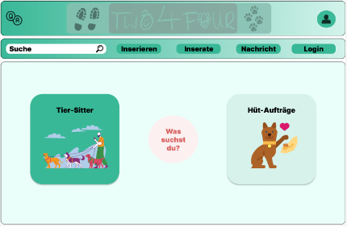
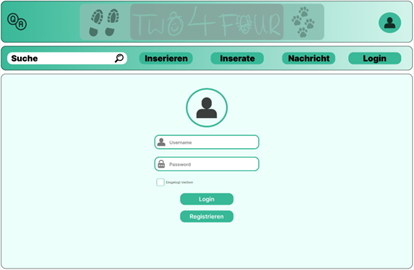
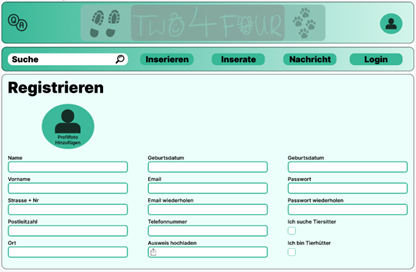
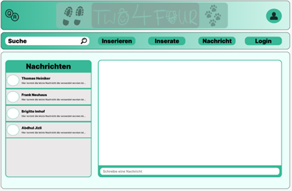
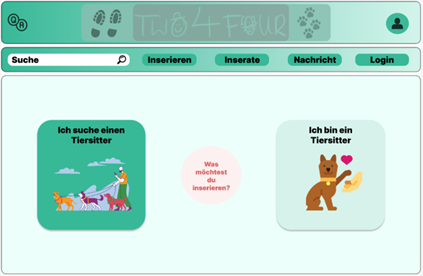
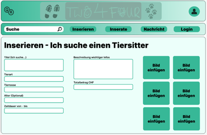
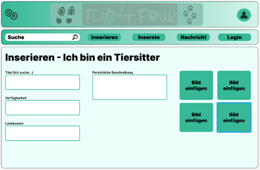
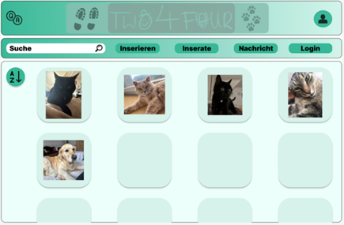
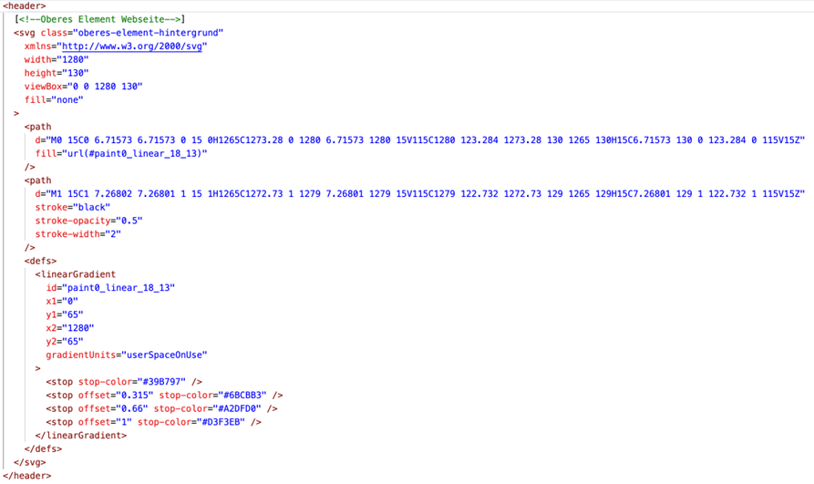
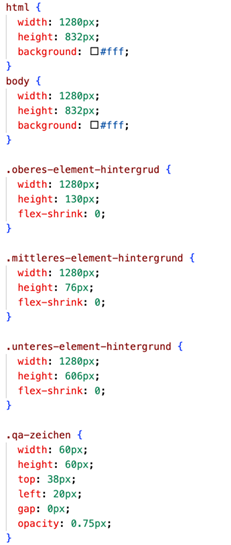

# Blogbeitrag Two4Four

## Ziele der Applikation
Unsere Gruppe hat sich zum Ziel gesetzt, eine moderne Plattform zu entwickeln, die es den Nutzern ermöglicht, vertrauenswürdige Betreuer für ihre Haustiere zu finden und Tierliebhabern (Tiersitter) eine Möglichkeit bietet ihre Zeit mit Tieren zu verbringen. Wir streben danach, eine benutzerfreundliche Umgebung zu schaffen, welche die Sicherheit, Vertrauenswürdigkeit und Zufriedenheit aller Nutzer gewährleistet. Ein weiteres Ziel ist es, den Tieren eine kontinuierliche Betreuung gewährleisten zu können, sollte der Haustierbesitzer verhindert sein. Den Tiersitter bietet unsere Lösung die Möglichkeit sich nebenbei noch ein Taschengeld zu sichern und die Zeit mit den Tieren zu verbringen. Somit schaffen wir es eine lebendige Community aufzubauen, in der die Nutzenden miteinander interagieren, Erfahrungen austauschen und Unterstützung finden können.

## Produktidee mit den wichtigsten Features
Unsere Produktidee konzentriert sich auf die Entwicklung einer Pet-Sharing-Plattfrom, welche eine einfache und effektive Möglichkeit bietet, die Betreuung von Haustieren zu gewährleisten und tierfreundliche Menschen zu verbinden. Zu unseren wichtigsten Features gehören:
 
- Erstellung von Benutzerprofilen für Haustierbesitzende und Tiersitter mit umfassenden Informationen
- Profilverwaltung, welche allen Nutzenden die Möglichkeit bietet, ihre persönlichen Informationen und Einstellungen stehts zu verwalten
- Möglichkeit für Haustierbesitzende detaillierte Profile für die Tiere zu erstellen und Betreuungsgesuche auszuschreiben
- Such- und Filterfunktionen, um passenden Tiersitter basierend auf Standort, Verfügbarkeit und Präferenzen zu finden
- Integriertes Kommunikationstool für den Austausch von Nachrichten und Details für die Haustierbetreuung
- Bewertungs- und Feedbacksystem zur Bewertung der Betreuungsleistung und Aufbau von zusätzlichem Vertrauen in der Community

## Hindernisse und Schwierigkeiten
Zusammenfassend betrachtet sind wir trotz einiger anfänglicher Hindernisse zuversichtlich, dass wir unser Ziel erreichen können. Zu Beginn hatten wir Schwierigkeiten, den Startschuss zu setzen und mit der Umsetzung zu beginnen, da wir nicht genau wussten, wie wir am besten und effektivsten starten sollten. Zudem blieben einige Fragen zu den verschiedenen Funktionen und anderen Aspekten offen. Um diese Hindernisse zu überwinden, haben wir uns entschieden, als Team ein Brainstorming durchzuführen und dann konkrete Schritte festzulegen. Als Massnahme haben wir beschlossen, dass jeder in der Gruppe sich Erklärvideos ansieht oder die relevanten Präsentationsfolien erneut durchgeht, um offene Fragen zu klären und das Verständnis zu vertiefen. Wir konnten uns auch gegenseitig unterstützen, indem wir einander bei Fragen halfen.

Beim Start der Entwicklung unserer Plattform sind wir dann auf weitere Hindernisse gestossen, insbesondere im Zusammenhang mit dem Verständnis und der Nutzung der verschiedenen Softwarekomponenten. Die Vielzahl an Programmen wie Strapi, Angular, Visual Studio Code und Insomnia stellte eine Herausforderung dar. Die Schwierigkeit bestand vor allem darin, zu verstehen, welche Rolle jede Softwarekomponente in unserem Projekt spielt und wie sie zusammenarbeiten.

Besonders bei Strapi, dem Headless-CMS, gab es Probleme. Die verfügbaren Tutorialvideos und -ressourcen deckten nicht die spezifischen Anforderungen unserer Plattform ab. Die Beispiele in den Tutorials unterschieden sich zu fest von unserer Plattformidee, was das Verständnis weiter erschwerte. Dies führte zu Verzögerungen und Unsicherheiten im Entwicklungsprozess. Da jedoch Strapi in der Vorlesung noch nicht vertieft angeschaut wurde, haben wir beschlossen, die spezifischen Fragen und Probleme in den kommenden Vorlesungen anzusprechen. Durch eine detailliertere Betrachtung und anderen relevanten Technologien in der Vorlesung erhoffen wir uns, eine klarere Vorstellung davon zu bekommen, wie wir die Software effektiv nutzen können, um unsere Plattform zu entwickeln. Eine Gefährdung des Projektes in Bezug auf Strapi besteht somit vorerst nicht.
Auch beim Verständnis der vielen Softwarekomponenten sehen wir keine Gefährdung des Projekts. Ähnlich wie bei Strapi haben wir die meisten anderen Komponenten noch nicht vertieft angeschaut oder verwendet. Es ist zudem nicht zwingend notwendig, jede Software bereits im Voraus perfekt zu kennen, da wir dies in unserer Projektgruppe aufteilen. Somit wird jedes Projektmitglied sich mit einer der Softwarekomponenten am besten auskennen und den anderen zeigen können. Dies ermöglicht eine effektive Zusammenarbeit und den Austausch von Wissen, um die verschiedenen Teile der Plattform erfolgreich zu entwickeln.

## Entwicklungsstand der Appllikation
Im Folgenden gewähren wir einige Einblicke in den aktuellen Stand unseres Projekts. Zunächst präsentieren wir unser Datenmodell in Form eines Entitäts-Beziehungs-Diagramms, das verdeutlicht, wie wir die Daten strukturieren wollen. Anschliessend zeigen wir ausgewählte Figma-Entwürfe verschiedener Seiten unserer Website. Darauf folgt ein kurzer Ausschnitt unseres HTML- und CSS-Codes, der einen Eindruck von der technischen Umsetzung gibt. Abschliessend erläutern wir unseren Tech-Stack und beschreiben, wie die einzelnen Technologien zusammenwirken, um unsere Plattform zu unterstützen.

## Datenmodell

Unser ER-Diagramm bildet das Herzstück der Datenarchitektur für unsere Tiersitter-Plattform und stellt die Beziehungen zwischen Tierbesitzern, Tiersittern und den Tieren selbst dar. Die Hauptentitäten in unserem Diagramm sind User, Pet, Location, Booking, Review und UserDocument, welche durch verschiedene Attribute charakterisiert werden.

## Figma
Dies ist die Startseite von Two4Four, das Tor zu unseren Dienstleistungen.

Betreten Sie den geschützten Bereich mit Ihrer Anmeldung auf der Login-Seite.

Registrieren Sie sich bei Two4Four und werden Sie Teil unserer Gemeinschaft auf der Registrierungsseite.

Treten Sie über unsere Messenger-Seite in direkten Kontakt mit anderen Mitgliedern von Two4Four.

Erstellen Sie Anzeigen, um Tiersitter zu finden oder Ihre Dienste als Tiersitter anzubieten, über unsere intuitive Anzeigenerstellungsseite.

Erstellen Sie ein Inserat um gezielt nach verfügbaren Tiersittern zu suchen.

Bieten Sie Ihre Qualifikationen als Tiersitter an, indem Sie sich selbst auf unserer Plattform inserieren.

Entdecken Sie eine Vielzahl von Anzeigen auf unserer Übersichtsseite, wo Benutzer nach Tiersittern suchen.

## HTML
Der gezeigte HTML-Code enthält ein SVG-Element, das gestaltete Pfade mittels eines linearen Farbverlaufs erzeugt, wobei die Pfade aus koordinierten Punkten und Linien bestehen. Dieser Farbverlauf, der sich zwischen zwei Farben ändert, bildet den Hintergrund für das obere Element der Webseite. Das gleiche Designprinzip wird auch für mittlere und untere Elemente angewendet. Aktuell besteht jedoch ein Kompatibilitätsproblem, da das SVG feste Höhen- und Breitenangaben aufweist, was zu Darstellungsproblemen auf Geräten mit grossen Bildschirmen führen kann.

## CSS
Das Bild zeigt einen kleinen CSS-Stylesheet-Ausschnitt für die Webseite. Die `html` und `body` Elemente sind auf eine feste Breite und Höhe von 1280px bzw. 832px gesetzt und haben einen weissen Hintergrund. Es gibt drei Klassen `.oberes-element-hintergrund`, `.mittleres-element-hintergrund` und `.unteres-element-hintergrund`, die jeweils auf die gleiche Breite von 1280px gesetzt sind, aber unterschiedliche Höhen haben. `flex-shrink` ist auf 0 gesetzt, was bedeutet, dass die Elemente nicht schrumpfen, wenn der umgebende Container zu klein ist. Die Klasse `.qa-zeichen` ist ein Beispiel und definiert ein kleines Element mit einer Breite und Höhe von 60px, einer geringen Deckkraft und ist positioniert mit `top` und `left`. Auch hier haben wir bisher noch bestimmte Höhen und breiten, was wir aber ändern werden damit es sich automatisch je nach Bildschirmgrösse anpasst.

## Techstack
Unser Tech-Stack basiert auf den Programmen und Sprachen, die wir im Unterricht erlernt haben und weiterhin erlernen werden. Als Team mit einem nicht-technischen Hintergrund beschränken sich unsere Kenntnisse hauptsächlich auf die Inhalte dieses Kurses. Für die Frontend-Entwicklung setzen wir auf Angular, einschliesslich HTML und CSS, und für das Backend verwenden wir Strapi. Unsere Datenbanken werden mit SQL verwaltet, mit dem wir bereits in einem vorangegangenen Semester praktische Erfahrungen sammeln konnten. Obwohl wir noch nicht abschliessend beurteilen können, wie alle Komponenten unseres Tech-Stacks im Endeffekt interagieren werden, bilden wir uns kontinuierlich in den verschiedenen zugewiesenen Bereichen fort. Die spezifische Aufgabenverteilung wird im folgenden Abschnitt detailliert erläutert.

## Aufgabenverteilung im Team
Von Anfang an war es uns wichtig, eine faire Arbeitsaufteilung für unser Projekt zu definieren und sicherzustellen, dass jeder im Team seinen Beitrag leisten kann.
Carlos ist unser Experte für die Frontend-Entwicklung. Er ist verantwortlich für Figma, Angular, HTML und CSS, um die Benutzeroberfläche unserer Plattform zu gestalten. Wir sind der Ansicht, dass es sinnvoll ist, wenn eine Person das Grundgerüst erstellt, bevor wir gemeinsam die Feinheiten besprechen.
Daniel und Silvan konzentrieren sich auf die Funktionsdefinition und die Erstellung von Personas. Gemeinsam arbeiten sie daran, die Anforderungen und Funktionen unserer Plattform klar zu definieren. Durch die Erstellung von Personas können wir die Bedürfnisse und Anforderungen unserer Nutzer besser verstehen und in die Entwicklung integrieren. Darüber hinaus kümmern sie sich um die Integration der Funktionen mit TypeScript. Sie unterstützen Carlos und Nelson ausserdem bei der Erstellung des Frontends und Backends.
Nelson trägt die Verantwortung für die Datenmodelle unserer Plattform und für das Backend, das mit Strapi erstellt wird. Er entwirft die Grundlage unserer Plattform und stellt sicher, dass sie effizient und skalierbar ist. Das Ziel ist es, die Datenintegrität zu gewährleisten und sicherzustellen, dass unsere Plattform die Bedürfnisse unserer Nutzer optimal erfüllt.
Dank der aktuellen Aufteilung konnten wir bereits einen soliden Anfang schaffen. Die künftigen Aufgaben, welche noch anstehen, sind noch nicht alle ins Detail definiert und zugeteilt. Trotzdem gehen wir mit gutem Gewissen an die restlichen Tasks und freuen uns auf die weitere Zusammenarbeit.

